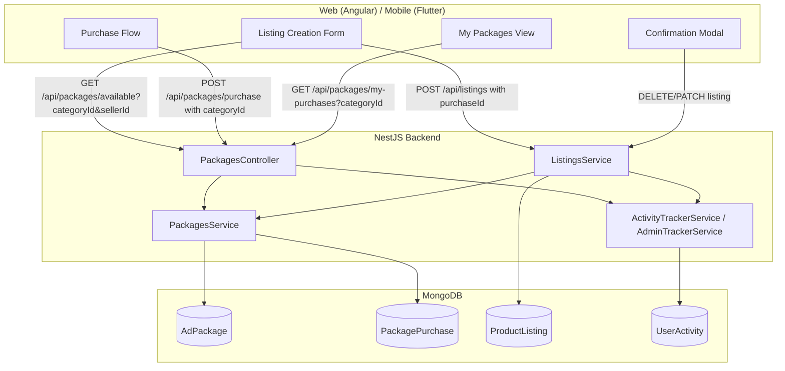
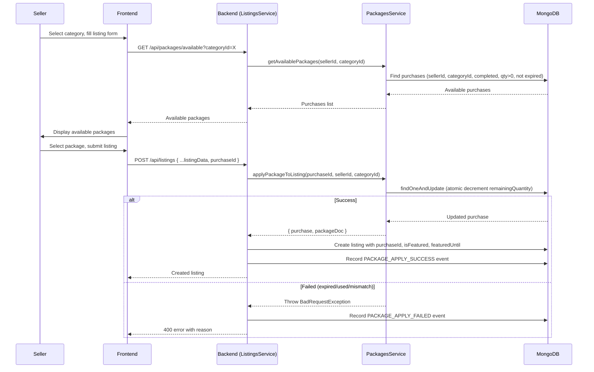

# Design Document: Category-Package Management

## Overview

This feature extends the existing marketplace package system to enforce category-scoped package lifecycle management. Today, packages (AdPackage) already support `categoryPricing` and purchases (PackagePurchase) already carry an optional `categoryId`, but the system does not enforce category matching when applying packages to listings, does not expose available-packages-per-category to the listing creation flow, and does not warn sellers about permanent consumption on delete/deactivate.

The design adds:
1. A new backend endpoint to query available packages filtered by category for a given seller.
2. A package-application flow at listing creation time that validates category match, atomically decrements `remainingQuantity`, and stores the `purchaseId` on the listing.
3. Permanent consumption semantics — no quantity restoration on listing delete, deactivate, or sold.
4. Confirmation modals on web and mobile when a seller deletes/deactivates a listing with an applied package.
5. Category-based filtering on the "My Packages" view.
6. Comprehensive event tracking across backend, web, and mobile for all package-related actions.

The implementation touches three layers: NestJS backend (packages + listings modules), Angular web frontend, and Flutter mobile app.

## Architecture



The key architectural decision is to keep package-application validation inside `PackagesService` (called by `ListingsService` during listing creation) rather than duplicating logic. The `ListingsService` delegates to `PackagesService.applyPackageToListing()` which performs atomic validation and decrement.

### Concurrency Strategy

For the atomic decrement of `remainingQuantity`, we use MongoDB's `findOneAndUpdate` with a filter condition `{ remainingQuantity: { $gt: 0 }, expiresAt: { $gt: now } }`. If the document is not found (because another request already consumed the last unit or the package expired), the operation returns `null` and we reject the request. This prevents over-decrementing without requiring distributed locks.

## Components and Interfaces

### Backend API Endpoints

#### 1. GET `/api/packages/available`
Returns available packages for a seller filtered by category.

**Query Parameters:**
| Parameter | Type | Required | Description |
|-----------|------|----------|-------------|
| categoryId | string (ObjectId) | Yes | The listing's category |

**Response:** `PackagePurchaseDocument[]` — purchases with `packageId` populated.

**Auth:** JWT required (sellerId from token).

#### 2. POST `/api/listings` (modified)
Accepts an optional `purchaseId` field. When provided, the backend validates and applies the package.

**New Body Field:**
| Field | Type | Required | Description |
|-------|------|----------|-------------|
| purchaseId | string (ObjectId) | No | The purchase to apply to this listing |

#### 3. GET `/api/packages/my-purchases` (modified)
Accepts an optional `categoryId` query parameter to filter purchases. Returns purchases with the associated category name populated.

**New Query Parameter:**
| Parameter | Type | Required | Description |
|-----------|------|----------|-------------|
| categoryId | string (ObjectId) | No | Filter by category |

#### 4. GET `/api/listings/:id` (modified)
When the listing has a `purchaseId`, the response includes populated package application details (package name, type, remaining quantity).

### Backend Service Methods

#### PackagesService (new/modified methods)

```typescript
// New: Get available packages for a seller in a specific category
async getAvailablePackages(sellerId: string, categoryId: string): Promise<PackagePurchaseDocument[]>

// New: Atomically apply a package to a listing
async applyPackageToListing(purchaseId: string, sellerId: string, categoryId: string): Promise<{ purchase: PackagePurchaseDocument; packageDoc: AdPackageDocument }>

// Modified: Accept optional categoryId filter
async getMyPurchases(sellerId: string, categoryId?: string): Promise<PackagePurchaseDocument[]>
```

#### ListingsService (modified methods)

```typescript
// Modified: Accept optional purchaseId, call PackagesService.applyPackageToListing
async createListing(sellerId: string, dto: CreateListingDto): Promise<ProductListingDocument>

// Modified: No quantity restoration on delete/deactivate/sold — existing behavior is already correct (no restoration logic exists), but we add event tracking
async deleteListing(listingId: string, sellerId: string): Promise<void>
async updateListingStatus(listingId: string, sellerId: string, status: ListingStatus): Promise<ProductListingDocument>
```

### Web Frontend Components

#### AvailablePackagesComponent (new)
Standalone Angular component displayed within the listing creation form. Fetches and displays available packages for the selected category. Emits the selected `purchaseId` to the parent form.

#### ConfirmationModalComponent (new or extended)
A reusable modal component that accepts package details and action type ("delete" | "deactivate"). Displays the package name, type, and a warning that the consumed unit is non-recoverable.

#### MyPackagesComponent (modified)
Add a category filter dropdown. Fetch categories from the existing categories endpoint and pass `categoryId` as a query parameter to `GET /api/packages/my-purchases`.

#### PackageListComponent (modified)
When a category is selected, display category-specific pricing instead of `defaultPrice`.

### Mobile Components

#### AvailablePackagesWidget (new)
Flutter widget using Riverpod. Fetches available packages for the selected category during listing creation.

#### ConfirmationDialog (new or extended)
A dialog widget that warns about permanent package consumption before delete/deactivate.

#### PackagesProvider (modified)
Add `loadAvailablePackages(categoryId)` method and `categoryFilter` state for My Packages filtering.

### Event Tracking

#### New UserAction enum values (backend)
```typescript
// Package application
PACKAGE_APPLY_SUCCESS = 'package_apply_success',
PACKAGE_APPLY_FAILED = 'package_apply_failed',
PACKAGE_EXPIRED = 'package_expired',

// Packaged listing lifecycle
PACKAGED_LISTING_DELETED = 'packaged_listing_deleted',
PACKAGED_LISTING_DEACTIVATED = 'packaged_listing_deactivated',
PACKAGED_LISTING_SOLD = 'packaged_listing_sold',
```

#### New TrackingEvent constants (web frontend)
```typescript
PACKAGE_APPLY: 'package_apply',
PACKAGE_LIST_VIEWED: 'package_list_viewed',
PACKAGE_CONFIRM_MODAL_SHOWN: 'package_confirm_modal_shown',
PACKAGE_CONFIRM_MODAL_CONFIRMED: 'package_confirm_modal_confirmed',
PACKAGE_CONFIRM_MODAL_CANCELLED: 'package_confirm_modal_cancelled',
PACKAGE_NONE_AVAILABLE: 'package_none_available',
PACKAGE_PURCHASE_CTA_CLICKED: 'package_purchase_cta_clicked',
PACKAGE_PURCHASE_INITIATED: 'package_purchase_initiated',
MY_PACKAGES_VIEWED: 'my_packages_viewed',
MY_PACKAGES_FILTER_CHANGED: 'my_packages_filter_changed',
```

Mobile tracking constants mirror the web constants.

## Data Models

### ProductListing Schema (modified)

Add a `purchaseId` field to track which purchase was applied:

```typescript
@Prop({ type: Types.ObjectId, ref: 'PackagePurchase', default: null })
purchaseId?: Types.ObjectId;
```

Add a compound index for efficient lookup:
```typescript
ProductListingSchema.index({ purchaseId: 1 });
```

### PackagePurchase Schema (modified)

Add a compound index for the available-packages query:
```typescript
PackagePurchaseSchema.index({ 
  sellerId: 1, 
  categoryId: 1, 
  paymentStatus: 1, 
  remainingQuantity: 1, 
  expiresAt: 1 
});
```

Populate `categoryId` with category name for the My Packages view:
```typescript
// In getMyPurchases query
.populate('categoryId', 'name')
.populate('packageId', 'name type')
```

### AdPackage Schema (unchanged)

The existing `categoryPricing` array already supports per-category pricing. No schema changes needed.

### UserActivity Schema (unchanged)

The existing schema already supports arbitrary `metadata` maps and `action` enum values. New event types are added to the `UserAction` enum only.

### Data Flow: Package Application




## Correctness Properties

*A property is a characteristic or behavior that should hold true across all valid executions of a system — essentially, a formal statement about what the system should do. Properties serve as the bridge between human-readable specifications and machine-verifiable correctness guarantees.*

### Property 1: Price Resolution Correctness

*For any* AdPackage with a `categoryPricing` array and *for any* `categoryId`, the resolved purchase price SHALL equal the `price` from the matching `categoryPricing` entry if one exists, otherwise it SHALL equal the `defaultPrice`.

**Validates: Requirements 1.2, 1.3**

### Property 2: Available Packages Filter Correctness

*For any* set of PackagePurchase records belonging to a seller, `getAvailablePackages(sellerId, categoryId)` SHALL return exactly those purchases where `categoryId` matches the requested category, `paymentStatus` is `"completed"`, `remainingQuantity` is greater than zero, and `expiresAt` is in the future — and no others.

**Validates: Requirements 2.1, 2.2, 2.3**

### Property 3: Available Packages Sort Order

*For any* result set returned by `getAvailablePackages`, the purchases SHALL be sorted by `expiresAt` in ascending order so that the soonest-expiring package appears first.

**Validates: Requirements 7.3**

### Property 4: Successful Package Application Invariants

*For any* valid package application (purchase is available, category matches, quantity > 0, not expired), after `applyPackageToListing` completes: (a) the purchase's `remainingQuantity` SHALL be exactly one less than before, (b) the created listing SHALL have `purchaseId` set to the applied purchase's ID, and (c) if the package type is `"featured_ads"`, the listing's `isFeatured` SHALL be `true` and `featuredUntil` SHALL equal the purchase's `expiresAt`.

**Validates: Requirements 3.2, 3.3, 3.4**

### Property 5: Category Mismatch Rejection

*For any* purchase with `categoryId` A and *for any* listing with `categoryId` B where A ≠ B, `applyPackageToListing` SHALL reject the request with a descriptive error, and the purchase's `remainingQuantity` SHALL remain unchanged.

**Validates: Requirements 3.1, 3.6**

### Property 6: Permanent Consumption (Non-Restoration)

*For any* listing with a Package_Application and *for any* listing status transition (delete, deactivate, or sold), the associated purchase's `remainingQuantity` SHALL remain unchanged after the transition — the system SHALL NOT increment `remainingQuantity` under any circumstance after the initial decrement.

**Validates: Requirements 4.1, 4.2, 4.3, 4.4**

### Property 7: Atomic Non-Negative Quantity

*For any* PackagePurchase, the `remainingQuantity` SHALL never be decremented below zero, even under concurrent application requests. If `remainingQuantity` is zero at the time of an atomic update attempt, the application SHALL be rejected.

**Validates: Requirements 7.5, 3.7**

### Property 8: Event CategoryId Completeness

*For any* package-related event recorded in UserActivity (actions matching `package_apply_success`, `package_apply_failed`, `package_expired`, `packaged_listing_deleted`, `packaged_listing_deactivated`, `packaged_listing_sold`), the event's metadata SHALL include a non-null `categoryId` field.

**Validates: Requirements 9.34**

## Error Handling

### Backend Error Responses

| Scenario | HTTP Status | Error Message |
|----------|-------------|---------------|
| Purchase not found | 404 | "Purchase not found" |
| Purchase categoryId doesn't match listing categoryId | 400 | "Package is not available for this category" |
| Purchase remainingQuantity is zero | 400 | "Package is fully used — no remaining units" |
| Purchase has expired | 400 | "Package has expired" |
| Purchase paymentStatus is not "completed" | 400 | "Package payment is not completed" |
| Invalid purchaseId format | 400 | "Invalid purchase ID" |
| Seller doesn't own the purchase | 403 | "You can only use your own packages" |

### Concurrency Error Handling

When the atomic `findOneAndUpdate` returns `null` (another request consumed the last unit or the package expired between validation and update), the service throws a `BadRequestException` with a message indicating the package is no longer available. The frontend should display this error and refresh the available packages list.

### Frontend Error Handling

- **Web:** On package application failure, the listing creation form displays the error message from the API response and refreshes the available packages dropdown.
- **Mobile:** Same behavior — display error via SnackBar and refresh the available packages list.
- **Confirmation Modal:** If the delete/deactivate API call fails after confirmation, display an error toast and keep the listing in its current state.

### Cron Job Error Handling

The existing `handleExpiredFeaturedAds` cron job already handles expired featured listings. The new `PACKAGE_EXPIRED` event tracking is added inside the cron job. If event tracking fails, it should not block the unflagging operation — tracking failures are logged but swallowed.

## Testing Strategy

### Unit Tests (Example-Based)

- **Price resolution:** Specific examples with known categoryPricing arrays and expected prices.
- **Package application:** Happy path with valid purchase, rejection cases for expired/used/mismatch.
- **Listing detail population:** Verify purchaseId is populated with package name and type.
- **My Packages filtering:** Verify categoryId query parameter filters results correctly.
- **Confirmation modal logic:** Verify modal appears for listings with purchaseId, skipped for those without.
- **Event tracking:** Verify each new event type is fired with correct metadata for specific scenarios.
- **Cron job:** Verify expired featured listings are unflagged and PACKAGE_EXPIRED events are recorded.

### Property-Based Tests

Property-based testing is appropriate for this feature because the core logic involves filtering, price resolution, and invariant preservation — all of which are pure functions or have clear input/output behavior with large input spaces.

**Library:** [fast-check](https://github.com/dubzzz/fast-check) for TypeScript backend tests.

**Configuration:** Minimum 100 iterations per property test.

**Tag format:** `Feature: category-package-management, Property {number}: {property_text}`

Each correctness property (1–8) maps to a single property-based test:

1. **Property 1 test:** Generate random AdPackage objects with varying `categoryPricing` arrays and random `categoryId` inputs. Assert the resolved price matches the expected value.
2. **Property 2 test:** Generate random sets of PackagePurchase documents with varying statuses, quantities, expiry dates, and categoryIds. Call `getAvailablePackages` and assert the result set matches the expected filter.
3. **Property 3 test:** Generate random available package sets. Assert the returned array is sorted by `expiresAt` ascending.
4. **Property 4 test:** Generate valid purchases and listings. Apply package. Assert remainingQuantity decreased by 1, listing has purchaseId, and featured flags are set correctly for featured_ads type.
5. **Property 5 test:** Generate purchase/listing pairs with mismatched categoryIds. Assert rejection and unchanged remainingQuantity.
6. **Property 6 test:** Generate listings with applied packages. Perform delete/deactivate/sold transitions. Assert remainingQuantity is unchanged after each transition.
7. **Property 7 test:** Generate purchases with remainingQuantity=1. Simulate concurrent apply attempts. Assert remainingQuantity never goes below 0.
8. **Property 8 test:** Trigger each package-related backend event. Assert all recorded UserActivity documents include `categoryId` in metadata.

### Integration Tests

- **Payment callback flow:** End-to-end test of purchase → payment callback → activation with category pricing.
- **Cron job:** Test `handleExpiredFeaturedAds` with real MongoDB documents.
- **Full listing creation flow:** Create listing with package application, verify all side effects.

### Frontend Component Tests

- **Web:** Angular TestBed tests for AvailablePackagesComponent, ConfirmationModalComponent, modified MyPackagesComponent, and modified PackageListComponent.
- **Mobile:** Flutter widget tests for AvailablePackagesWidget, ConfirmationDialog, and modified PackagesProvider.
