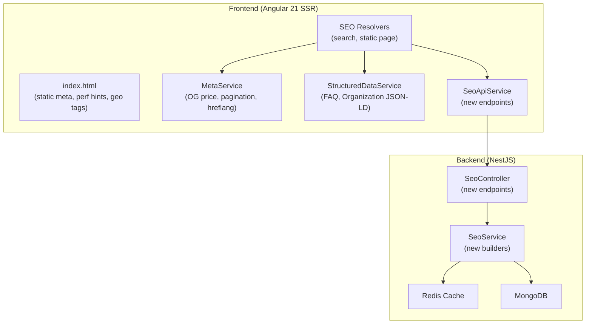
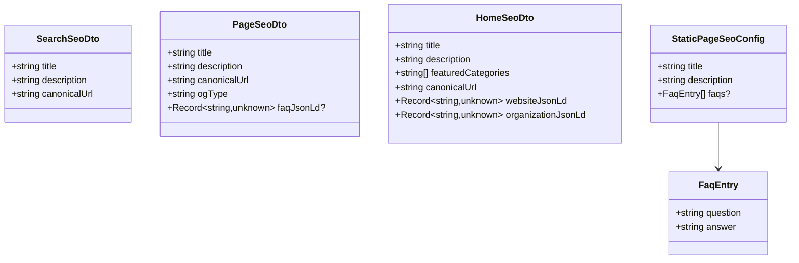

# Design Document: SEO Enhancements

## Overview

This design covers 10 SEO enhancement areas for the marketplace.pk Angular 21 + NestJS application. The application already has a mature SSR + SEO foundation: server-side rendering via `@angular/ssr`, canonical URLs, OG/Twitter tags, Product/BreadcrumbList/ItemList/WebSite JSON-LD structured data, sitemap.xml, robots.txt, prerendering, meta descriptions, Redis caching, SEO API endpoints, and route resolvers for listing/category/seller/home pages.

The enhancements fall into three categories:

1. **Backend API extensions** (Requirements 1–3, 9–10): New SEO API endpoints and DTO fields for search pages, static pages, FAQ schema, and Organization schema; plus price fields already available in the listing DTO.
2. **Frontend service extensions** (Requirements 1–6): Extending `MetaService` with OG price tags, pagination links, and hreflang tags; extending `StructuredDataService` with FAQ and Organization JSON-LD; adding new SEO resolvers for search and static pages.
3. **Static HTML template changes** (Requirements 5, 7, 8): Adding default meta tags, performance hints, and geo meta tags directly to `index.html`.

The design preserves the existing architecture patterns: backend builds SEO metadata and caches it in Redis, frontend resolvers fetch it before component render, and services inject tags into the document head during SSR.

## Architecture



### Data Flow

1. **Route navigation** triggers a resolver (existing pattern).
2. **Resolver** calls `SeoApiService` which hits the backend `GET /api/seo/*` endpoint.
3. **SeoService** checks Redis cache → on miss, queries MongoDB, builds the DTO, caches it, and returns.
4. **Resolver** receives the DTO and calls `MetaService` / `StructuredDataService` to inject tags into the document head.
5. **SSR** renders the complete HTML with all meta tags, JSON-LD, and link elements visible to crawlers.

### Design Decisions

| Decision | Rationale |
|---|---|
| Static page SEO metadata is hardcoded in the backend constant map rather than stored in MongoDB | These 9 pages change rarely; a constant map avoids a DB collection and simplifies deployment. The map is keyed by slug and returns title, description, and optional FAQ data. |
| Hreflang tags point to the same canonical URL for both `en` and `ur` | The marketplace serves the same URL for both languages (no `/ur/` prefix). Hreflang signals to Google that the page serves both audiences. When a separate Urdu URL structure is added later, only the href values need updating. |
| Pagination links use `rel="next"` / `rel="prev"` despite Google deprecating them | Other search engines (Bing, Yandex) still use them, and they don't hurt Google indexing. Low cost, potential benefit. |
| Performance hints go in `index.html` rather than being injected dynamically | DNS-prefetch and preconnect are most effective when present in the initial HTML before any JS executes. Static placement is simpler and faster. |
| OG price tags are set in the existing `listingSeoResolver` | No new endpoint needed — the listing SEO DTO already contains `price` and `currency` fields. The resolver just needs to call new `MetaService` methods. |
| Organization schema is returned from the existing `/api/seo/home` endpoint | Avoids a separate API call. The home page resolver already fetches home SEO data; adding `organizationJsonLd` to the response is a backward-compatible extension. |

## Components and Interfaces

### Backend Changes

#### 1. New SEO API Endpoints

**`GET /api/seo/search?q={query}`** — Search page SEO metadata

```typescript
// SeoController addition
@Get('search')
async getSearchSeo(@Query('q') query?: string): Promise<SearchSeoDto> {
  return this.seoService.getSearchSeo(query);
}
```

**`GET /api/seo/page/:slug`** — Static page SEO metadata

```typescript
// SeoController addition
@Get('page/:slug')
async getPageSeo(@Param('slug') slug: string): Promise<PageSeoDto> {
  return this.seoService.getPageSeo(slug);
}
```

#### 2. New DTOs

```typescript
// dto/search-seo.dto.ts
export class SearchSeoDto {
  title!: string;
  description!: string;
  canonicalUrl!: string;
}

// dto/page-seo.dto.ts
export class PageSeoDto {
  title!: string;
  description!: string;
  canonicalUrl!: string;
  ogType!: string;
  faqJsonLd?: Record<string, unknown>;  // optional FAQ structured data
}
```

#### 3. Extended HomeSeoDto

```typescript
// dto/home-seo.dto.ts — add field
export class HomeSeoDto {
  // ... existing fields ...
  organizationJsonLd!: Record<string, unknown>;
}
```

#### 4. New SeoService Methods

```typescript
// seo.service.ts additions
getSearchSeo(query?: string): Promise<SearchSeoDto>;
getPageSeo(slug: string): Promise<PageSeoDto>;
buildOrganizationJsonLd(): Record<string, unknown>;
buildFaqJsonLd(faqs: FaqEntry[]): Record<string, unknown>;
```

#### 5. Static Page SEO Constants

```typescript
// common/constants/static-page-seo.constants.ts
export interface StaticPageSeoConfig {
  title: string;
  description: string;
  faqs?: { question: string; answer: string }[];
}

export const STATIC_PAGE_SEO: Record<string, StaticPageSeoConfig> = {
  about: {
    title: 'About Us | marketplace.pk',
    description: 'Learn about marketplace.pk — Pakistan\'s trusted online marketplace...',
  },
  terms: {
    title: 'Terms of Service | marketplace.pk',
    description: 'Read the terms of service for marketplace.pk...',
  },
  // ... all 9 static pages
};
```

### Frontend Changes

#### 1. MetaService Extensions

```typescript
// meta.service.ts — new methods

/** Set OG price tags for product listings. */
setProductPriceTags(amount: number, currency: string): void;

/** Remove OG price tags (for non-product pages). */
removeProductPriceTags(): void;

/** Set rel="next" and/or rel="prev" pagination links. */
setPaginationLinks(config: { nextUrl?: string; prevUrl?: string }): void;

/** Remove all pagination link elements. */
removePaginationLinks(): void;

/** Set hreflang link elements for the current page. */
setHreflangTags(canonicalUrl: string): void;

/** Remove all hreflang link elements. */
removeHreflangTags(): void;
```

#### 2. StructuredDataService Extensions

```typescript
// structured-data.service.ts — new methods

/** Inject FAQPage JSON-LD. */
setFaqData(data: object): void;

/** Inject Organization JSON-LD. */
setOrganizationData(data: object): void;
```

#### 3. New SEO API Methods

```typescript
// seo-api.service.ts — new methods
getSearchSeo(query?: string): Observable<SearchSeoResponse | null>;
getPageSeo(slug: string): Observable<PageSeoResponse | null>;
```

#### 4. New Frontend Models

```typescript
// models/seo.models.ts — additions
export interface SearchSeoResponse {
  title: string;
  description: string;
  canonicalUrl: string;
}

export interface PageSeoResponse {
  title: string;
  description: string;
  canonicalUrl: string;
  ogType: string;
  faqJsonLd?: Record<string, unknown>;
}

// Extend HomeSeoResponse
export interface HomeSeoResponse {
  // ... existing fields ...
  organizationJsonLd: Record<string, unknown>;
}
```

#### 5. New SEO Resolvers

```typescript
// resolvers/seo.resolver.ts — additions
export const searchSeoResolver: ResolveFn<SearchSeoResponse | null>;
export const pageSeoResolver: ResolveFn<PageSeoResponse | null>;
```

#### 6. Updated Route Configurations

- `search.routes.ts`: Add `resolve: { seo: searchSeoResolver }`
- `pages.routes.ts`: Add `resolve: { seo: pageSeoResolver }` to each static page route (using a shared resolver that reads the slug from the route path)

#### 7. index.html Additions

Static tags added directly to `<head>`:

- Default robots directive: `<meta name="robots" content="index, follow">`
- Default OG tags: `og:site_name`, `og:type`, `og:image`
- Theme color: `<meta name="theme-color" content="#1a73e8">`
- Format detection: `<meta name="format-detection" content="telephone=no">`
- Geo meta tags: `geo.region`, `geo.placename`, `geo.position`, `ICBM`
- Performance hints: `dns-prefetch` and `preconnect` for API domain, CDN domain, Google Fonts

## Data Models

### New Backend DTOs



### Cache Keys and TTLs

| Cache Key Pattern | TTL | Description |
|---|---|---|
| `seo:search:{query}` | 600s (10 min) | Search page SEO metadata |
| `seo:page:{slug}` | 86400s (24 hr) | Static page SEO metadata |
| `seo:home` (existing) | 3600s (1 hr) | Home page SEO (now includes Organization JSON-LD) |

### New Constants

```typescript
// app.constants.ts additions
export const CACHE_KEY_SEO_SEARCH = 'seo:search:';
export const CACHE_KEY_SEO_PAGE = 'seo:page:';
export const CACHE_TTL_SEO_SEARCH = 600;    // 10 minutes
export const CACHE_TTL_SEO_PAGE = 86400;    // 24 hours

// API endpoints (frontend)
SEO_SEARCH: '/seo/search',
SEO_PAGE: (slug: string) => `/seo/page/${slug}`,
```

### Organization Schema Structure

```json
{
  "@context": "https://schema.org",
  "@type": "Organization",
  "name": "marketplace.pk",
  "url": "https://marketplace.pk",
  "logo": "https://marketplace.pk/assets/logo.png",
  "description": "Pakistan's trusted online marketplace for buying and selling new and used products.",
  "contactPoint": {
    "@type": "ContactPoint",
    "contactType": "Customer Service",
    "availableLanguage": ["English", "Urdu"]
  },
  "sameAs": [],
  "address": {
    "@type": "PostalAddress",
    "addressCountry": "PK"
  }
}
```

### FAQ Schema Structure

```json
{
  "@context": "https://schema.org",
  "@type": "FAQPage",
  "mainEntity": [
    {
      "@type": "Question",
      "name": "How do I create an account?",
      "acceptedAnswer": {
        "@type": "Answer",
        "text": "Visit the registration page and..."
      }
    }
  ]
}
```


## Correctness Properties

*A property is a characteristic or behavior that should hold true across all valid executions of a system — essentially, a formal statement about what the system should do. Properties serve as the bridge between human-readable specifications and machine-verifiable correctness guarantees.*

### Property 1: Search SEO metadata follows title and description patterns

*For any* non-empty query string, the search SEO metadata builder SHALL produce a title matching `"Search: {query} | marketplace.pk"` and a description matching `"Find {query} listings on marketplace.pk. Browse results and discover the best deals in Pakistan."` where `{query}` is the input query string.

**Validates: Requirements 2.2, 2.3**

### Property 2: Search canonical URL excludes pagination and filter parameters

*For any* URL containing a `q` query parameter along with arbitrary pagination parameters (`page`, `offset`) and tracking parameters (`utm_source`, `utm_medium`, `utm_campaign`, `fbclid`, `gclid`), the canonical URL builder SHALL produce a URL that retains only the `q` parameter and strips all others.

**Validates: Requirements 2.4**

### Property 3: Static page canonical URL construction

*For any* valid static page slug from the set (about, terms, privacy, contact, careers, press, trust-safety, selling-tips, cookies), the page SEO builder SHALL produce a canonical URL equal to `"https://marketplace.pk/pages/{slug}"`.

**Validates: Requirements 3.4**

### Property 4: Pagination links reflect current page position

*For any* pagination state defined by a current page number (1 ≤ currentPage ≤ totalPages) and a total page count (totalPages ≥ 1), the pagination link setter SHALL: inject a `rel="prev"` link if and only if currentPage > 1, inject a `rel="next"` link if and only if currentPage < totalPages, and construct each link URL using the canonical base URL with a `page` query parameter. After any call, no stale pagination links from a previous state SHALL remain.

**Validates: Requirements 4.1, 4.2, 4.3, 4.4, 4.5, 4.6**

### Property 5: Hreflang tags are complete and current

*For any* canonical URL string, calling the hreflang setter SHALL result in exactly three `<link rel="alternate">` elements in the document head: one with `hreflang="en"`, one with `hreflang="ur"`, and one with `hreflang="x-default"`, all with `href` equal to the provided canonical URL. Calling the setter again with a different URL SHALL update all three hrefs without creating duplicates.

**Validates: Requirements 6.1, 6.2, 6.3, 6.5**

### Property 6: FAQ JSON-LD structure conforms to schema.org FAQPage

*For any* non-empty array of FAQ entries (each with a question string and an answer string), the FAQ JSON-LD builder SHALL produce an object with `@context` equal to `"https://schema.org"`, `@type` equal to `"FAQPage"`, and a `mainEntity` array where each element has `@type` `"Question"`, a `name` field equal to the question text, and an `acceptedAnswer` object with `@type` `"Answer"` and `text` equal to the answer text. The length of `mainEntity` SHALL equal the length of the input array.

**Validates: Requirements 9.1, 9.4**

## Error Handling

### Backend Error Handling

| Scenario | Behavior |
|---|---|
| `GET /api/seo/search?q=` (empty query) | Return generic search metadata with fallback title "Search Listings \| marketplace.pk" |
| `GET /api/seo/page/:slug` with invalid slug | Return HTTP 404 `NotFoundException` |
| Redis cache failure (GET or SET) | Log warning, continue without cache (existing pattern in `SeoService`) |
| MongoDB query failure | Let NestJS global exception filter return HTTP 500 |

### Frontend Error Handling

| Scenario | Behavior |
|---|---|
| SEO API call fails or times out during SSR | Resolver catches error, calls `MetaService.setFallbackMeta()`, returns `null` (existing pattern) |
| SEO API returns `null` data | Resolver sets fallback meta tags (existing pattern) |
| Listing has no price (undefined/null) | `setProductPriceTags` is not called; `removeProductPriceTags` ensures no stale price tags exist |
| Static page has no FAQ data | `faqJsonLd` field is undefined; resolver skips `setFaqData` call |
| DOM manipulation fails (e.g., `document` not available) | Methods guard against missing `document` — relevant only in non-SSR test environments |

### Graceful Degradation

All SEO enhancements are additive. If any enhancement fails:
- The page still renders correctly with existing SEO tags
- Fallback meta tags provide baseline SEO signals
- The `index.html` static tags (robots, OG defaults, geo, performance hints) are always present regardless of API/resolver failures

## Testing Strategy

### Unit Tests (Example-Based)

| Area | Tests |
|---|---|
| **MetaService.setProductPriceTags** | Verify `og:price:amount`, `og:price:currency`, `product:price:amount`, `product:price:currency` tags are set with correct values |
| **MetaService.removeProductPriceTags** | Verify price tags are removed when listing has no price |
| **MetaService.setProductPriceTags edge cases** | Verify tags are omitted for undefined/null/zero prices |
| **SeoService.getSearchSeo** | Verify correct DTO for query "iphone", empty query, special characters |
| **SeoService.getPageSeo** | Verify correct DTO for each of the 9 static page slugs |
| **SeoService.getPageSeo invalid slug** | Verify `NotFoundException` for unknown slugs |
| **SeoService.buildOrganizationJsonLd** | Verify all required fields: name, url, logo, contactPoint, sameAs, address |
| **HomeSeoDto.organizationJsonLd** | Verify the field is populated in the home SEO response |
| **StructuredDataService.setFaqData** | Verify JSON-LD script tag is injected with correct content |
| **StructuredDataService.setOrganizationData** | Verify JSON-LD script tag is injected with correct content |
| **index.html static tags** | Verify presence of robots, OG defaults, theme-color, format-detection, geo tags, performance hints |
| **Route configuration** | Verify search and static page routes include SEO resolvers |

### Property-Based Tests

Property-based tests use `fast-check` (already available in the project's test ecosystem with Vitest). Each test runs a minimum of 100 iterations.

| Property | Generator Strategy | Assertion |
|---|---|---|
| **Property 1: Search SEO metadata patterns** | Generate random non-empty strings (alphanumeric, unicode, special chars) as query values | Title matches `"Search: {query} \| marketplace.pk"`, description matches expected pattern |
| **Property 2: Search canonical URL stripping** | Generate random URLs with `q` param plus random combinations of tracking/pagination params | Output URL contains only the `q` parameter |
| **Property 3: Static page canonical URL** | Generate from the fixed set of 9 valid slugs | Canonical URL equals `"https://marketplace.pk/pages/{slug}"` |
| **Property 4: Pagination links correctness** | Generate random (currentPage, totalPages) pairs where 1 ≤ currentPage ≤ totalPages, totalPages ≥ 1 | Correct presence/absence of rel=next/prev links with correct URLs; no stale links |
| **Property 5: Hreflang tags completeness** | Generate random canonical URL strings, then generate a second URL and call setter again | Exactly 3 hreflang links with correct hrefs; no duplicates after update |
| **Property 6: FAQ JSON-LD structure** | Generate random arrays of {question: string, answer: string} objects | Output has correct @context, @type, mainEntity array with matching length and correct Question/Answer structure |

**Test Configuration:**
- Library: `fast-check` with Vitest
- Minimum iterations: 100 per property
- Tag format: `Feature: seo-enhancements, Property {N}: {title}`

### Integration Tests

| Area | Tests |
|---|---|
| `GET /api/seo/search?q=iphone` | Verify response shape and status 200 |
| `GET /api/seo/search` (no query) | Verify fallback response |
| `GET /api/seo/page/about` | Verify response with correct title, description, canonical URL |
| `GET /api/seo/page/unknown` | Verify 404 response |
| `GET /api/seo/home` | Verify response includes `organizationJsonLd` field |
| Redis caching for search SEO | Verify cache hit returns same data, TTL is 600s |
| Redis caching for page SEO | Verify cache hit returns same data, TTL is 86400s |
