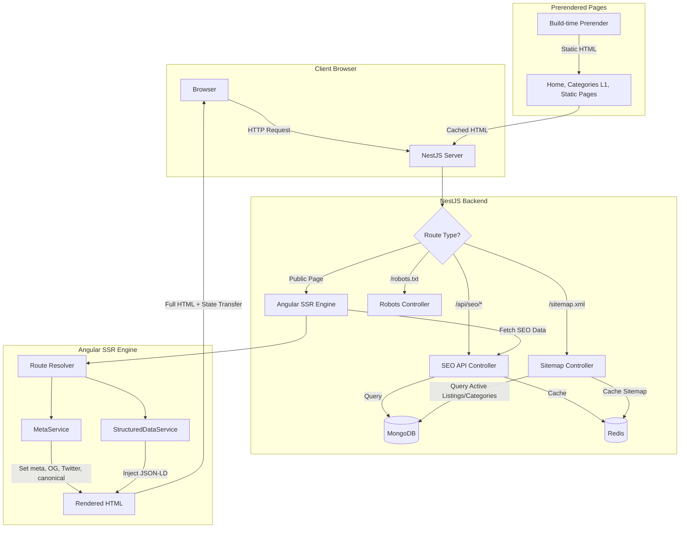

# Design Document: SEO & SSR Implementation

## Overview

This design covers the implementation of Server-Side Rendering (SSR) and comprehensive SEO optimization for the marketplace.pk Angular 21 + NestJS application. The current application is a client-side rendered SPA, which means search engine crawlers receive an empty HTML shell and cannot index marketplace content.

The solution introduces:
- **Angular SSR** using the `@angular/ssr` package (the Angular 21 successor to Angular Universal) to render pages on the server
- **A dedicated `SeoModule`** in the NestJS backend providing API endpoints for SEO metadata, sitemap generation, and robots.txt
- **Frontend SEO services** (`MetaService`, `StructuredDataService`) that run during SSR to inject meta tags, Open Graph/Twitter Card tags, canonical URLs, and JSON-LD structured data
- **A prerendering strategy** for high-traffic static pages using Angular's built-in prerender builder

The architecture keeps SEO business logic (title templates, description truncation, structured data schemas) in the NestJS backend via dedicated SEO API endpoints, while the Angular frontend consumes this data during SSR to set the appropriate HTML head elements. This separation avoids duplicating business logic across frontend and backend.

## Architecture



### Key Architectural Decisions

1. **Angular SSR via `@angular/ssr`**: Angular 21 uses the `@angular/ssr` package with Express-based server. This replaces the older Angular Universal approach. The SSR server runs as part of the Angular build output and can be served by NestJS or as a standalone Express server.

2. **SEO data from backend API**: Rather than hardcoding SEO templates in the frontend, the NestJS backend exposes `/api/seo/*` endpoints that return pre-computed SEO metadata (titles, descriptions, structured data). This centralizes business logic and makes it testable independently.

3. **Redis caching for SEO endpoints**: SEO metadata is read-heavy and changes infrequently. Redis caching with configurable TTLs reduces database load. Listings cache for 5 minutes, categories for 30 minutes, static content for 1 hour.

4. **Sitemap generation via cron**: The sitemap is regenerated on a schedule (default: every 6 hours) rather than on-demand, avoiding expensive database queries on each request. The generated XML is cached in Redis.

5. **Prerendering for critical pages**: The home page, top-level category pages, and static pages are prerendered at build time. A scheduled job refreshes them (home: hourly, static: daily). This provides instant response times for the highest-traffic pages.

6. **State transfer to prevent double-fetching**: Angular's `TransferState` API transfers server-fetched data to the client, preventing duplicate API calls during hydration.

## Components and Interfaces

### Backend Components (NestJS)

#### SeoModule
The central NestJS module that encapsulates all SEO-related backend functionality.

```typescript
// backend/src/seo/seo.module.ts
@Module({
  imports: [
    MongooseModule.forFeature([
      { name: ProductListing.name, schema: ProductListingSchema },
      { name: Category.name, schema: CategorySchema },
      { name: User.name, schema: UserSchema },
    ]),
  ],
  controllers: [SeoController, SitemapController, RobotsController],
  providers: [SeoService, SitemapService, SlugService],
  exports: [SeoService, SlugService],
})
export class SeoModule {}
```

#### SeoController
Exposes REST endpoints for SEO metadata.

```typescript
// backend/src/seo/seo.controller.ts
@Controller('api/seo')
export class SeoController {
  @Get('listing/:id')
  getListingSeo(@Param('id') id: string): Promise<ListingSeoDto>

  @Get('category/:slug')
  getCategorySeo(@Param('slug') slug: string): Promise<CategorySeoDto>

  @Get('seller/:id')
  getSellerSeo(@Param('id') id: string): Promise<SellerSeoDto>

  @Get('home')
  getHomeSeo(): Promise<HomeSeoDto>
}
```

#### SeoService
Core service that queries MongoDB and builds SEO metadata DTOs. Handles description truncation, title formatting, breadcrumb construction, and structured data assembly.

```typescript
// backend/src/seo/seo.service.ts
@Injectable()
export class SeoService {
  getListingSeo(id: string): Promise<ListingSeoDto>
  getCategorySeo(slug: string): Promise<CategorySeoDto>
  getSellerSeo(id: string): Promise<SellerSeoDto>
  getHomeSeo(): Promise<HomeSeoDto>
  buildBreadcrumb(categoryPath: Types.ObjectId[]): Promise<BreadcrumbItem[]>
  truncateDescription(description: string, maxLength: number): string
  buildProductJsonLd(listing: ProductListing, seller: User, breadcrumb: BreadcrumbItem[]): object
  buildCategoryJsonLd(category: Category, listings: ProductListing[]): object
  buildSellerJsonLd(seller: User): object
  buildWebsiteJsonLd(): object
}
```

#### SitemapService
Generates XML sitemaps from database content.

```typescript
// backend/src/seo/sitemap.service.ts
@Injectable()
export class SitemapService {
  generateSitemap(): Promise<string>
  generateSitemapIndex(sitemapUrls: string[]): string
  buildListingUrls(): Promise<SitemapUrl[]>
  buildCategoryUrls(): Promise<SitemapUrl[]>
  buildSellerUrls(): Promise<SitemapUrl[]>
  buildStaticUrls(): SitemapUrl[]
}
```

#### SitemapController
Serves the sitemap.xml at the root path.

```typescript
// backend/src/seo/sitemap.controller.ts
@Controller()
export class SitemapController {
  @Get('sitemap.xml')
  getSitemap(): Promise<string>

  @Get('sitemap-:index.xml')
  getSitemapPart(@Param('index') index: string): Promise<string>
}
```

#### RobotsController
Serves the robots.txt file.

```typescript
// backend/src/seo/robots.controller.ts
@Controller()
export class RobotsController {
  @Get('robots.txt')
  getRobotsTxt(): string
}
```

#### SlugService
Handles URL slug generation including transliteration of Urdu text.

```typescript
// backend/src/seo/slug.service.ts
@Injectable()
export class SlugService {
  generateSlug(title: string): string
  generateListingUrl(listing: ProductListing): string
  generateCategoryUrl(category: Category): string
  generateSellerUrl(sellerId: string): string
  stripTrackingParams(url: string): string
}
```

### Frontend Components (Angular)

#### MetaService
Angular service that sets HTML head meta tags during SSR.

```typescript
// web/src/app/core/services/meta.service.ts
@Injectable({ providedIn: 'root' })
export class MetaService {
  setPageMeta(config: PageMetaConfig): void
  setOpenGraphTags(config: OpenGraphConfig): void
  setTwitterCardTags(config: TwitterCardConfig): void
  setCanonicalUrl(url: string): void
  setFallbackMeta(): void
  clearMeta(): void
}
```

#### StructuredDataService
Angular service that injects JSON-LD script tags into the document head.

```typescript
// web/src/app/core/services/structured-data.service.ts
@Injectable({ providedIn: 'root' })
export class StructuredDataService {
  setProductData(data: ProductJsonLd): void
  setCategoryData(data: CategoryJsonLd): void
  setSellerData(data: SellerJsonLd): void
  setWebsiteData(data: WebsiteJsonLd): void
  setBreadcrumbData(breadcrumbs: BreadcrumbItem[]): void
  clearStructuredData(): void
}
```

#### SeoApiService
Angular HTTP service that calls the backend SEO API endpoints.

```typescript
// web/src/app/core/services/seo-api.service.ts
@Injectable({ providedIn: 'root' })
export class SeoApiService {
  getListingSeo(id: string): Observable<ListingSeoResponse>
  getCategorySeo(slug: string): Observable<CategorySeoResponse>
  getSellerSeo(id: string): Observable<SellerSeoResponse>
  getHomeSeo(): Observable<HomeSeoResponse>
}
```

#### Route Resolvers
Each public route gets a resolver that fetches SEO data and sets meta tags before the component renders.

```typescript
// web/src/app/core/resolvers/seo.resolver.ts
export const listingSeoResolver: ResolveFn<ListingSeoResponse> = (route) => { ... }
export const categorySeoResolver: ResolveFn<CategorySeoResponse> = (route) => { ... }
export const sellerSeoResolver: ResolveFn<SellerSeoResponse> = (route) => { ... }
export const homeSeoResolver: ResolveFn<HomeSeoResponse> = (route) => { ... }
```

### SSR Configuration

#### Server Entry Point
```typescript
// web/src/main.server.ts
import { bootstrapApplication } from '@angular/platform-browser';
import { App } from './app/app';
import { serverConfig } from './app/app.config.server';

const bootstrap = () => bootstrapApplication(App, serverConfig);
export default bootstrap;
```

#### Server App Config
```typescript
// web/src/app/app.config.server.ts
export const serverConfig: ApplicationConfig = {
  providers: [
    ...appConfig.providers,
    provideServerRendering(),
    provideServerRoutesConfig(serverRoutes),
  ],
};
```

## Data Models

### Backend DTOs

```typescript
// backend/src/seo/dto/listing-seo.dto.ts
export class ListingSeoDto {
  title: string;              // "{listing.title} - {currency} {amount} | marketplace.pk"
  description: string;        // Truncated to 160 chars
  imageUrl: string;           // First image URL or placeholder
  price: number;
  currency: string;
  categoryBreadcrumb: BreadcrumbItem[];
  sellerName: string;
  averageRating: number | null;
  reviewCount: number;
  canonicalUrl: string;
  productJsonLd: object;      // Pre-built Product schema.org JSON-LD
  breadcrumbJsonLd: object;   // Pre-built BreadcrumbList JSON-LD
}

// backend/src/seo/dto/category-seo.dto.ts
export class CategorySeoDto {
  title: string;              // "{category.name} - Buy & Sell {category.name} in Pakistan | marketplace.pk"
  description: string;
  breadcrumb: BreadcrumbItem[];
  listingCount: number;
  canonicalUrl: string;
  itemListJsonLd: object;     // Pre-built ItemList JSON-LD
  breadcrumbJsonLd: object;
}

// backend/src/seo/dto/seller-seo.dto.ts
export class SellerSeoDto {
  title: string;              // "{seller.name} - Seller Profile | marketplace.pk"
  description: string;        // Includes city and listing count
  avatarUrl: string;
  city: string;
  memberSince: Date;
  isVerified: boolean;
  activeListingCount: number;
  canonicalUrl: string;
  personJsonLd: object;       // Pre-built Person/Organization JSON-LD
}

// backend/src/seo/dto/home-seo.dto.ts
export class HomeSeoDto {
  title: string;              // "marketplace.pk - Buy & Sell in Pakistan"
  description: string;
  featuredCategories: string[];
  canonicalUrl: string;
  websiteJsonLd: object;      // Pre-built WebSite JSON-LD with SearchAction
}

// Shared types
export class BreadcrumbItem {
  name: string;
  url: string;
  position: number;
}

export class SitemapUrl {
  loc: string;
  lastmod?: string;
  changefreq?: string;
  priority: number;
}
```

### Frontend Interfaces

```typescript
// web/src/app/core/models/seo.models.ts
export interface PageMetaConfig {
  title: string;
  description: string;
  imageUrl?: string;
  canonicalUrl: string;
  ogType?: 'website' | 'product' | 'profile';
  twitterCard?: 'summary' | 'summary_large_image';
}

export interface OpenGraphConfig {
  title: string;
  description: string;
  image: string;
  url: string;
  type: string;
  siteName: string;
}

export interface TwitterCardConfig {
  card: string;
  title: string;
  description: string;
  image: string;
}
```

### Sitemap XML Structure

```xml
<?xml version="1.0" encoding="UTF-8"?>
<urlset xmlns="http://www.sitemaps.org/schemas/sitemap/0.9">
  <url>
    <loc>https://marketplace.pk/</loc>
    <lastmod>2024-01-01T00:00:00Z</lastmod>
    <priority>1.0</priority>
  </url>
  <url>
    <loc>https://marketplace.pk/listings/iphone-15-pro-abc123</loc>
    <lastmod>2024-01-15T12:00:00Z</lastmod>
    <priority>0.8</priority>
  </url>
</urlset>
```

### Robots.txt Structure

```
User-agent: *
Allow: /
Allow: /listings/
Allow: /categories/
Allow: /seller/
Allow: /search
Allow: /pages/
Disallow: /profile
Disallow: /favorites
Disallow: /messaging
Disallow: /admin
Disallow: /auth
Disallow: /listings/create
Disallow: /listings/my
Disallow: /listings/*/edit
Crawl-delay: 1
Sitemap: https://marketplace.pk/sitemap.xml
```


## Correctness Properties

*A property is a characteristic or behavior that should hold true across all valid executions of a system — essentially, a formal statement about what the system should do. Properties serve as the bridge between human-readable specifications and machine-verifiable correctness guarantees.*

### Property 1: Meta title follows page-type template

*For any* page type (listing, category, search, seller) and its associated data, the generated meta title SHALL follow the correct template pattern for that page type: listings use `"{title} - {currency} {amount} | marketplace.pk"`, categories use `"{name} - Buy & Sell {name} in Pakistan | marketplace.pk"`, search uses `"Search: {query} | marketplace.pk"`, and sellers use `"{name} - Seller Profile | marketplace.pk"`.

**Validates: Requirements 2.2, 2.3, 2.4, 2.5**

### Property 2: Description truncation preserves content within limit

*For any* listing description string, the truncated description SHALL have a length of at most 160 characters, and if the original description is 160 characters or fewer, the truncated description SHALL equal the original.

**Validates: Requirements 2.2**

### Property 3: Social sharing tags completeness

*For any* page type and its associated data, the generated HTML SHALL contain all required Open Graph tags (og:title, og:description, og:image, og:url, og:type, og:site_name) and, for listing pages, all required Twitter Card tags (twitter:card, twitter:description, twitter:image). The og:image and twitter:image SHALL never be empty — if the entity has no image, a placeholder image URL SHALL be used.

**Validates: Requirements 3.1, 3.2, 3.3, 3.4, 3.6**

### Property 4: JSON-LD schema correctness per entity type

*For any* entity (listing, category, seller, or home page), the generated JSON-LD SHALL be valid JSON containing a `@context` field set to `"https://schema.org"`, a `@type` field matching the entity type (Product, ItemList, Person/Organization, or WebSite), and all required fields for that schema type.

**Validates: Requirements 4.1, 4.3, 4.5, 4.7**

### Property 5: Conditional aggregateRating inclusion

*For any* listing with a non-zero review count, the Product JSON-LD SHALL include an `aggregateRating` object with `ratingValue` and `reviewCount` fields. *For any* listing with zero reviews, the Product JSON-LD SHALL NOT include an `aggregateRating` object.

**Validates: Requirements 4.2**

### Property 6: BreadcrumbList reflects category hierarchy

*For any* category path (sequence of ancestor categories), the generated BreadcrumbList JSON-LD SHALL contain one `ListItem` per category in the path, with `position` values incrementing from 1, and each item's `name` and URL matching the corresponding category in the hierarchy.

**Validates: Requirements 4.6**

### Property 7: URL pattern correctness per entity type

*For any* entity (listing, category, seller, or search query), the generated URL SHALL follow the correct pattern: listings use `"/listings/{slug}-{id}"`, categories use `"/categories/{slug}"`, sellers use `"/seller/{id}"`, and search uses `"/search?q={query}"`. The canonical URL for each entity SHALL match this generated URL.

**Validates: Requirements 5.2, 5.3, 5.5, 10.1, 10.2, 10.3, 10.4**

### Property 8: Canonical URL strips extraneous parameters

*For any* URL containing pagination parameters (page, offset) or tracking parameters (utm_source, utm_medium, utm_campaign, fbclid, gclid), the generated canonical URL SHALL exclude those parameters while preserving content-relevant parameters.

**Validates: Requirements 5.4, 5.6**

### Property 9: Slug generation produces URL-safe output

*For any* input string (including strings with non-ASCII characters, Urdu text, special characters, and mixed scripts), the generated slug SHALL contain only lowercase alphanumeric characters and hyphens, SHALL NOT start or end with a hyphen, and SHALL NOT contain consecutive hyphens.

**Validates: Requirements 10.5**

### Property 10: Sitemap URL metadata correctness

*For any* URL entry in the sitemap, the `lastmod` date SHALL match the entity's `updatedAt` timestamp (for listings) and the `priority` value SHALL match the specification: 1.0 for home, 0.8 for listings, 0.7 for categories, 0.5 for sellers, 0.3 for static pages.

**Validates: Requirements 6.3, 6.4**

### Property 11: Sitemap XML validity and splitting

*For any* set of URLs, the generated sitemap XML SHALL conform to the sitemaps.org protocol schema. When the URL count exceeds 50,000, the sitemap SHALL be split into multiple files each containing at most 50,000 URLs, and a sitemap index file SHALL reference all parts.

**Validates: Requirements 6.1, 6.5**

### Property 12: Sitemap includes only active content

*For any* set of listings with mixed statuses, the sitemap SHALL include URLs only for listings with `status === 'active'` and SHALL exclude listings with any other status (inactive, pending_review, rejected, sold, reserved, expired, deleted).

**Validates: Requirements 6.7**

### Property 13: SEO API response completeness

*For any* existing entity (listing, category, or seller), the SEO API response SHALL contain all required metadata fields: listings return title, description, imageUrl, price, currency, categoryBreadcrumb, sellerName, averageRating, and reviewCount; categories return name, description, breadcrumb, and listingCount; sellers return name, city, memberSince, verificationStatus, and activeListingCount.

**Validates: Requirements 9.1, 9.2, 9.3**

## Error Handling

### SSR Error Handling
- **Rendering failures**: If the Angular SSR engine throws during rendering (e.g., API timeout, component error), the server returns the client-side rendered shell HTML with a 200 status code, allowing the browser to bootstrap the SPA normally. Errors are logged with request context for debugging.
- **API timeout during SSR**: SEO API calls during SSR have a 2-second timeout. If the timeout is exceeded, the page renders with fallback meta tags (generic marketplace title and description) rather than blocking the response.
- **Missing data**: If a listing, category, or seller is not found during SSR, the server returns a 404 status code with a "not found" page that includes appropriate meta tags (noindex).

### SEO API Error Handling
- **404 Not Found**: When a requested listing, category, or seller does not exist, the API returns `{ statusCode: 404, message: "Resource not found" }`.
- **Invalid IDs**: Malformed MongoDB ObjectIds are caught by validation pipes and return 400 Bad Request.
- **Redis cache failures**: If Redis is unavailable, the service falls back to direct MongoDB queries. Cache write failures are logged but do not affect the response.

### Sitemap Error Handling
- **Database query failures**: If the sitemap generation query fails, the service returns the last cached sitemap from Redis. If no cached version exists, it returns a minimal sitemap containing only the home page and static pages.
- **Oversized sitemaps**: The 50,000 URL limit per file is enforced. If a single generation cycle produces more URLs, the service automatically creates a sitemap index.

### Slug Generation Error Handling
- **Empty input**: If the title is empty or contains only non-transliterable characters, the slug defaults to `"listing"` (or the entity type).
- **Duplicate slugs**: Slugs are combined with the entity ID in the URL pattern (`{slug}-{id}`), so slug uniqueness is not required.

## Testing Strategy

### Property-Based Testing (fast-check)

The backend already has `fast-check` (v4.7.0) installed as a dev dependency. Property-based tests will use fast-check with Jest (the existing backend test runner). Each property test runs a minimum of 100 iterations.

**Property tests target the pure logic layer:**
- `SeoService` methods: title generation, description truncation, JSON-LD construction, breadcrumb building
- `SlugService` methods: slug generation, URL pattern construction, parameter stripping
- `SitemapService` methods: XML generation, URL splitting, priority assignment, status filtering

Each property test is tagged with a comment referencing the design property:
```
// Feature: seo-ssr-implementation, Property 1: Meta title follows page-type template
```

### Unit Tests (Jest + Vitest)

**Backend (Jest):**
- `SeoController`: Verify correct routing, parameter validation, 404 handling
- `RobotsController`: Verify robots.txt content matches specification (Allow/Disallow directives, Sitemap directive, Crawl-delay)
- `SitemapController`: Verify correct content-type headers, routing

**Frontend (Vitest):**
- `MetaService`: Verify meta tags are set/cleared correctly in the document head
- `StructuredDataService`: Verify JSON-LD script tags are injected/removed correctly
- `SeoApiService`: Verify HTTP calls to correct endpoints with correct parameters

### Integration Tests

- SSR rendering: Verify that public routes return fully rendered HTML containing expected content
- SEO API + MongoDB: Verify that API endpoints return correct data from seeded database
- Redis caching: Verify cache population and TTL behavior
- Sitemap generation with real data: Verify complete sitemap from seeded database

### Smoke Tests

- SSR serves all public routes without errors
- `/sitemap.xml` returns valid XML
- `/robots.txt` returns correct text content
- Prerendered HTML files exist for critical pages
- SSR does not reference browser-only APIs (no `window`, `localStorage`, `document.addEventListener` in server bundles)
